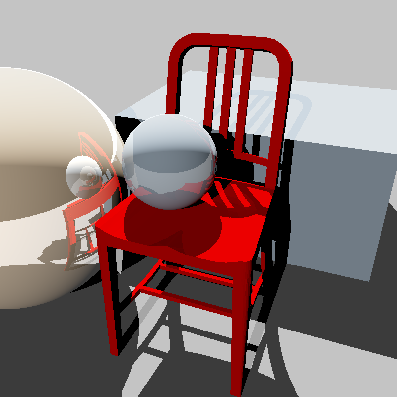

# Ray Tracer

A C++ ray tracer implemented without using OpenGL.

## Key Features

### Geometry

- Render basic geometric shapes including spheres, planes, and triangles.
- Handle the interior surfaces of objects for more accurate rendering.

### Lighting

- Support for parallel light sources and point light sources.
- Ability to handle multiple lights and negative lighting for more complex scenes.
- Accurate shadow rendering based on the interaction between objects and light sources.
- Adjustable exposure control for fine-tuning scene illumination.

### Materials

- Realistic material representation using diffuse lighting, which simulates the scattering of light off an object's surface.
- Support for specular lighting, allowing for the reflection of light off an object's surface to create highlights and mirror-like reflections.

### Sampling

- Flexible camera configuration with adjustable eye, forward, and up positions to create unique viewing perspectives.

## Usage

### Compile

You can build the code with `cmake`.

```sh
cmake .
make
```

### Generate Image

```sh
./program your-text.txt
```

The content of the `your-text.txt` should following the example file above.

## Example Output



